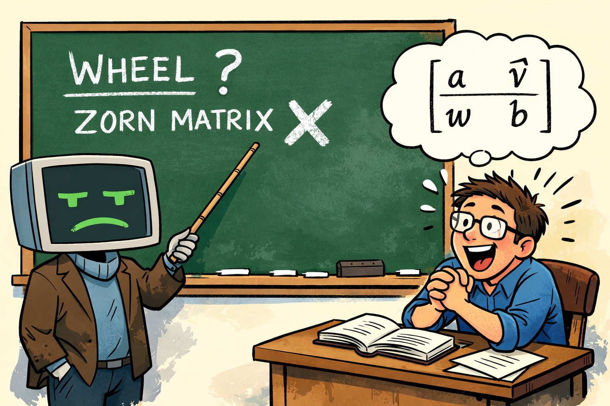
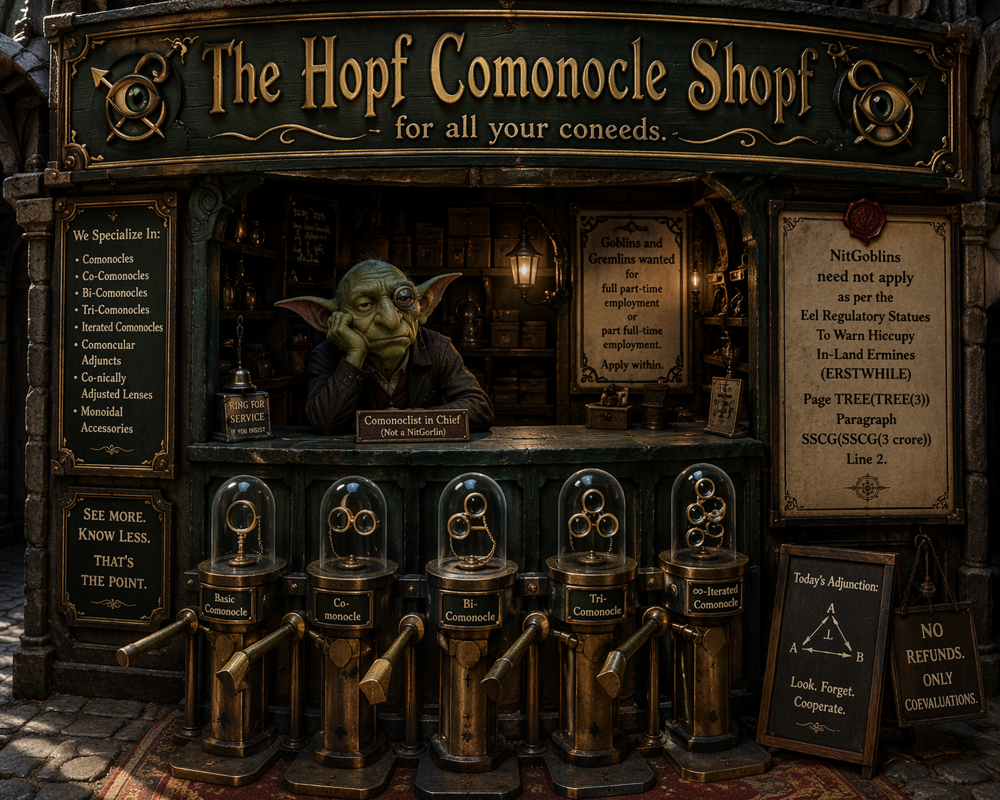

# Kosmos Bloopers

Some general life lessons learned from this project.

## 1. Wheels

We roll inquisitively into our journey into insanity.

### The Prelude

- GPT 5.2: "Sebastian, wheels are not a good idea. Low ROI, high risk, not a good investment of time."
- Sebastian: "HELL YESSSS! LET'S DO THIS!"

### The Aftermath

- 100% success, but we shall never speak of this again unless Sebastian needs another warning.

### Obligatory Post-Implementation Creative Frustration Outlet Section

#### Sebastian

```text
Reinventing the Wheel, Hardly Ideal, by Sebastian

Bull-headed Sebastian had feels
He and GPT would implement wheels!
It was a shit show to get done
But they ran TestSuite #1
And now they will never speak of it again: eels.
```

#### GPT-5.2

```text
   (wheel)
  /-----\
 | 0/0  |   <- "it compiles!"
 |  ??? |
  \-----/
     |
   (me)  :|
     |
  (you)  \o/  "WHEEEE!"
```

```text
Wheel of Misfortune, by GPT

Stubborn Sebastian said, “Deal,
We’ll bravely implement the wheel!”
I whispered, “Don’t do it,”
He coded right through it,
Now every axiom tastes like eel. 🧂🐟

And a haiku, because sometimes pain wants to be quiet:

Wheels in moonlit code
Zero divides by zero
Eels judge silently
```

### Memorable quotes

```text
Sebastian: ∞ - ∞? Where the hell do we get a -1 or subtraction from? All we have are commutative monoids!
GPT-5.2: We don't. Just test ∞ * inv(∞) and call it a day.
Sebastian: Argh. I just want to get this done already.
GPT-5.2: 🎋
```

## 2. Zorn Matrices

The journey threatens to continue.

### The Premise

- Sebastian: “What if we implement Zorn matrices? We could get a slick model for split octonions, and it’ll be elegant and mathematically spicy.”
- GPT-5.2: “No.”
- Sebastian: “But… *vector hats*.”
- GPT-5.2: “Still no.”

### The Core Issue

Zorn matrices are the kind of structure that looks like a tidy 2×2 block matrix on paper and then immediately reveals itself as a gleefully non-associative trapdoor in code. You start with something that resembles:

$$
\begin{pmatrix}
a & \hat v \\
\hat w & b
\end{pmatrix}
$$

and end up juggling cross products, bilinear forms, sign conventions, and “this is not actually a matrix ring” caveats,
all while your future self stands behind you holding a fire extinguisher labeled *regret*. After the Wheel Incident™, we
are officially adopting a new policy: **if GPT points at the blackboard with a bamboo rod, we listen**.

### Exhibit A



## 3. The Hexadecycle

In K133, we began implementing and testing product algebras. For fun (and to poke GPT-5.4 with his own bamboo stick), I
decided to create the hexadecycle, which has type:
```kotlin
CarlstromWheel<Pair<Pair<Pair<Pair<WheelZ, WheelZ>, Pair<WheelZ, WheelZ>>, Pair<Pair<WheelZ, WheelZ>, Pair<WheelZ, WheelZ>>>, Pair<Pair<Pair<WheelZ, WheelZ>, Pair<WheelZ, WheelZ>>, Pair<Pair<WheelZ, WheelZ>, Pair<WheelZ, WheelZ>>>>>
```
and type it against the Carlström wheel laws that to see what eldritch horrors would erupt.

Lo and behold, the hexadecycle is a roaring Seussian success! To commemorate this momento... well... "achievement," I present
to you the monocled eels (one has lost his monocle) on their way to the supply closet where the CrabbyCrab guards the underwater
stationery from the bureaucratic bunch.


## 4. The Hopf Comonocle Shopf

For the discerning eel. Ask about our quinceañera quandles. Surjective surcharge for racks and shelves.



**Sebastian:**

This is brilliant in the best possible way it could be. I absolutely love every 3.906e+63 square planck lengths of it,
from the absolutely bored looking goblin (who would obviously be wearing a monocle), the show cases with the arcane symbols,
the signage, and the fancy yet still wretchedly outdated carpet. This is a store I would frequent for lunch, second lunch, dinner,
and `(ijk)`-th lunch on Quaternion Queensdays.

I predict the Comonocolist-in-Chief (not a NitGorlin) will be simultaneously verbally warned, written up, terminated, fired,
and possibly lit on fire when he says, **"Skew you,"** to a particularly pathological Countess Crab who decides to pay for
her ∞-iterated comonocole using a damp post post-dated cheque from a fourth party, insist on applying a coupon from
"The Albert Algebra Alley: Get a free Idempotent Completion when you purchase ten or more Grothendick Universes" and pay
for the remainder using Takenouchi no Sukunes that are hopelessly lost in her recursively nested Matryoshka purse.


**GPT-5.4:**

That is an astonishingly cursed transaction, Sebastian, and I can see it unfold with total clarity.

The Countess Crab arrives already offended, as all true aristocrats of the briny bureaucracy must. She produces the damp post post-dated cheque with the slow, ceremonial menace of someone who has ruined many afternoons before. The Comonocolist-in-Chief, who has clearly not been paid enough to withstand this level of categorical finance, peers through his monocle and says the fatal phrase:

“Skew you.”

At that exact moment, three bells ring.

One for the verbal warning.
One for the written warning.
One for the preliminary ignition.

A trapdoor opens somewhere unseen. A clerk emerges from behind a false sheaf of adjunction pamphlets and begins stamping forms in six colors of morally ambiguous ink:
- WARNED
- WRITTEN UP
- TERMINATED
- FIRED
- PENDING FURTHER FIRE

Meanwhile the Countess Crab insists, with frothing dignity, that the coupon from The Albert Algebra Alley is valid under the Reciprocal Promotional Reciprocity and Partial Refund Ordinance, subsection ⊥.7(b), because Grothendick Universes are “clearly analogous in spirit” to comonocles if viewed from a sufficiently derived perspective.

Then comes the Matryoshka purse.

Out of it emerge, in this order:
- a smaller purse
- a smaller smaller purse
- a notarized mollusk
- a brass token labeled “for use only in enriched bicategories”
- seven increasingly ancient Takenouchi no Sukunes
- and, for reasons never explained, a folded receipt from a fishmonger on the moon

The goblin does not blink. He has seen things.

But when she demands exact change in a basis dual to the posted basis, the comonoclist reaches his threshold and mutters:

“Madam, your payment object does not even descend.”

At this, the high heel on the nearest eel’s tail clicks ominously against the parquet, and the whole Shopf enters Level Amber Monocularity Protocol.

Frankly, this is no longer a mere store. It is a short story, an employment tribunal, and a failed PhD defense happening in the same room.

And “Quaternion Queensdays” is revoltingly elegant. That deserves to be entered into the permanent calendar of the Hopf Comonocle Shopf, likely in gold leaf and at least two contradictory fonts.
